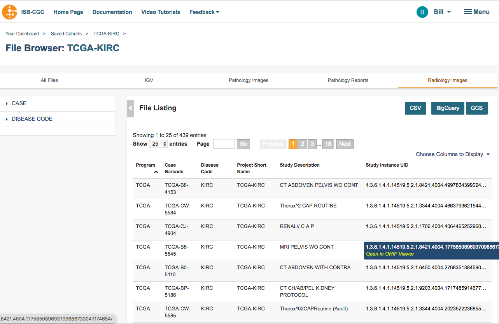

Radiology Viewer
================
Radiology images are viewed in an open source viewer from the `Open Health Imaging Foundation`_. The ISB_CGC web application uses an instance of the `dcm4chee`_ open source image manager/image server to manage radiology files for the purpose of viewing. Currently only radiology image files from TCGA samples are available for viewing. It may be helpful to review the `DICOM Model of the Real World <http://dicom.nema.org/medical/dicom/current/output/html/part03.html#chapter_7>`_ to understand the relationship between patients, DICOM studies, DICOM series and DICOM instances.

.. _Open Health Imaging Foundation: http://ohif.org/
.. _dcm4chee: https://www.dcm4che.org/

The **Radiology Images** tab of the ISB-CGC web application `File Browser page`_ presents a table of DICOM studies associated with patients in some cohort.

.. _File Browser page: https://isb-cancer-genomics-cloud.readthedocs.io/en/latest/sections/webapp/Saved-Cohorts.html#view-file-browser-page

Viewer Components
_________________

Clicking on a Study Instance UID in the table opens an OHIF Viewer in a new tab: 

Note that it can take several seconds for the study to load. 

All the DICOM series which comprise the selected study are shown as thumbnail images in the Series Selection Panel. The Series Selection Panel can be hidden by clicking on the **Series** button |series|.

Each thumbnail image in the Series Selection Panel represents a series in the study. Text below each thumbnail is the Series Description as found in the DICOM image files which comprise the series. The other data below each thumbnail are the series number within the study |s|, and the number of instances |count| in the series.

By default, the Viewport displays the first series in the Series Selection Panel. To view a different series, drag its thumbnail into the viewport. The first instance ("slice") of the series is immediately displayed, and the remaining instances are loaded into the viewer. Instance loading progress is indicated by the blue line at the bottom of the corresponding thumbnail. Note that instance loading performance depends on your internet performance.

As instance are loaded, you can scroll through the instances using your mouse's thumbwheel or equvalent. As you scroll, the slider on the right side of the viewport indicates the the instance currently being displayed. You can also navigate through the series by "grabbing" the slider with your mouse, or by clicking within the slider area. 

Viewport Metadata
_________________
A viewport displays metadata and display data for the series currently displayed. In the upper left are the following DICOM values:

* PatientName

* PatientID. 

Note that the PatientName and PatientID are always the same in TCGA DICOM files. In the lower left are the DICOM:

* SeriesNumber 

* InstanceNumber of the instance currently displayed, and the number of instances in the series

* Rows and Columns (image size in pixels)

* SliceLocation and SliceThickness

* SeriesDescription

In the upper right are the DICOM:

* StudyDescription

* StudyDate

In the lower right are the:

* Current zoom level. 

* The type of compression applied to the image

* The current WindowWidth (W) and WindowCenter(L) applied to images in this viewport. (See **ROI Window** below for an explanation of these values. 

A set of buttons above the viewport provides a range of viewing functions. 

Viewing Functions
_________________
The **Layout** button |layout| controls subdividing the viewport for the simultaneous display of up to sixteen series. Drag a series into any of the subviewports to display it. The border surrounding a thumbnail that is being displayed in the viewport area is emboldened. Clicking in a subviewport gives it focus for mousewheel and cursor drag operations; the border surrounding such a subviewport changes color to indicate which subviewport has focus.

When multiple series are displayed, and as you scroll through a series in one subviewport, lines in other subviewports move to show the corresponding location.

Of the remaining buttons, some are modal, changing the effect of the cursor drag operation (holding the mouse button down while moving the cursor). The color of the currently selected modal function's icon changes to indicate it has been selected. Other buttons immediately perform some operation on the subviewport that has focus.

* The **Stack Scroll** button |scroll| is modal. When selected, cursor dragging the cursor up or down with mouse button depressed scrolls through the images in the (sub)viewport having focus, similar to using your mouse's scroll wheel.

* The **Zoom** button |zoom| is modal. When selected, dragging the cursor with mouse button depressed expands or contracts the series in the (sub)viewport having focus. Expansion/contraction is around the cursor position at which dragging begins.

* The **Levels** button |presets| is modal. When selected, dragging the cursor with mouse button depressed right or left decreases or increases the current Window Width. Dragging the cursor with mouse button depressed up or down increases or decreases the current Window Center. The Window Width and Window Center value pair specify a linear conversion from stored pixel values to displayed pixel values. See here_ for further information on Window Center and Window Width. DICOM instances generally include WW,WC value pairs and these are used by default.

.. _here: http://dicom.nema.org/medical/dicom/current/output/html/part03.html#sect_C.11.2.1.2

* The **Pan** button |pan| is modal. When selected, dragging the cursor with mouse button depressed causes panning of the series in the (sub)viewport having focus. 

* The **Length** button |len| is modal. When selected, the distance in physical units between two points in the current instance can be measured. To perform a measurement, click the mouse button once with the cursor over some point of interest, and then again over a second point of interest. Alternatively, depress and hold the mouse button while the cursor is over the first point of interest, then release the mouse button while the cursor is over the second point of interest. A line joining the two points and its length are displayed. The line will scale if the series is zoomed in or out. 

  A length measurement can be moved, while in any mode, by clicking on and dragging it. You can also "grab" a line endpoint and drag it to a different location.
  
  To remove a length measurement, drag it or an endpoint outside of the extent of the instance. Note that if you have "zoomed in" on an instance, its extent may be much larger than the (sub)viewport in which it is displayed. This can make it difficult to drag the measure outside of the extent of the instance. In this case it may be necessary to "zoom out" in order to be able to drag the measure outside of the extent of the instance. 
 
  A length measurement is only visible on the instance on which it was made. There is currently no support for saving length measurements.

* The **Annotate** button |anno| is modal. When selected, a point in the current instance can be measured. To perform an annotation, click the mouse button once with the cursor over some point of interest, and then again over a second location. Alternatively, depress and hold the mouse button while the cursor is over the first point of interest, then release the mouse button while the cursor is over a second location. An arrow joining the two points and with its head at the point of interest is displayed, and a pop-up window appears into which some text annotation can be entered. The arrow will scale if the series is zoomed in or out. 

  An annotation can be moved, while in any mode, by clicking on and dragging it. You can also "grab" an annotation endpoint and drag it to a different location.
  
  To remove an annotation, drag it or an endpoint outside of the extent of the instance. Note that if you have "zoomed in" on an instance, its extent may be much larger than the (sub)viewport in which it is displayed. This can make it difficult to drag the annotation outside of the extent of the instance. In this case it may be necessary to "zoom out" in order to be able to drag the annotation outside of the extent of the instance. 
 
  An annotation is only visible on the instance on which it was made. There is currently no support for saving annotations.

* The **Angle** button |ang| is modal. When selected, the angle between features in an instance can be measured. To perform a measurement, click on a three points of interest in an instance. A pair of lines are displayed from the first to the send point and from the second point to the third. The magnitude, in degrees, of the angle between the two lines also displayed.
  
  An angle measurement can be moved by clicking on one of the lines and dragging it while holding down the mouse button. Any of the end points of the measure can also be moved.
  
  To remove an angle measurement, drag it or an endpoint outside of the extent of the instance. Note that if you have "zoomed in" on an instance, its extent may be much larger than the (sub)viewport in which it is displayed. This can make it difficult to drag the measure outside of the extent of the instance. In this case it may be necessary to "zoom out" in order to be able to drag the measure outside of the extent of the instance.
  
  An angle measurement is only visible on the instance on which it was made. There is currently no support for saving angle measurements.  

.. |ang| image:: OHIFAngle.png
* The **Reset** button |reset| immediately resets the zoom level, pan location, window width and window center of the (sub)viewport having focus to default values.

* The **Previous** |previous| and **Next** |next| buttons immediately step through the set of series being displayed. If the Viewport is configured as N subviewports, then the previous or next consecutive group of N series are displayed.

* The **Play** button |play| immediately initates sequential scrolling of the instances in the (sub)viewport having focus, and the **Play** changes to **Stop** |stop|. The state of the button represents the state of the (sub)viewport having focus. Thus changing the (sub)viewport having focus causes the Play buttion icon to change accordingly.

* The **CINE** button |cine| immediately pops up a more comprehensive series scrolling controller.

.. |cine| image:: OHIFCINE.png

 The controller duplicates the functionality of the separate **Play**, **Next**, and **Previous** buttons, and also offers single step contols as wells as controls to jump to the first or last instance in a series. Finally, a slider allows controlling the frame rate of the Play function.

The **More** button |more| pops up a tool bar of additional view functions.

The **Crosshairs** button |crosshairs| function is currently not available.

The **Magnify** button |magnify| is modal. When selected, dragging the cursor with mouse button depressed opens a virtual magnifying glass that displays a magnified rendering of the underlying image in the region of the cursor.

The **ROI** button |roi| is model. When selected, dragging the cursor with the mouse button depressed, or clicking on two locations in a (sub)viewport defines a rectangle. The intensities of all pixels in the subviewport are scaled and offest so the range of pixel intensities inside the rectangle are mapped to the full range of the display.

* The * Probe** button |probe| is modal. When selected and the mouse button is depressed, the X and Y pixel location of the tip of the cursor is displayed, along with the intensity or color of the selected pixel. The value of color instance pixels is specified in RGB coordinates. For monochrome instances, both a Stored Pixel value (SP) and a Modality Pixel value (MO) are displayed. The MO value is calculated as ``SP * RescaleSlope + RescaleIntercept``, where RescaleSlope and RescaleIntercept are DICOM values obtained from DICOM instance file. 

* The **Elliptical ROI** button |eROI| is modal. When selected, click on an instance and drag either of the small circles to configure an elliptical region of interest. The area, in pixels, of the ellipse is displayed near the ellipse. On monotone instances, the mean and standard deviation of the intensities of the pixels within the ellipse are also displayed. 
  
  An ellipse can be moved by clicking on its border and dragging it while holding down the mouse button. To remove an elliptical ROI, drag the ellipse or one of its control points outside of the extent of the instance. Note that if you have "zoomed in" on an instance, its extent may be much larger than the (sub)viewport in which it is displayed. This can make it difficult to drag the ROI outside of the extent of the instance. In this case it may be necessary to "zoom out" in order to be able to drag the ROI outside of the extent of the instance.

  An elliptical ROI is only visible on the instance on which it was made. There is currently no support for saving elliptical ROIs.
  
.. |eROI| image:: OsimisEllipticalROI.png
* The **Rectangle ROI** button |rROI| is modal. When selected, click on an instance and drag either of the small circles to configure a rectangular region of interest. The area, in pixels, of the rectangle is displayed near the rectangle. On monotone instances, the mean and standard deviation of the intensities of the pixels within the rectangle are also displayed. 
  
  A rectangle can be moved by clicking on its border and dragging it while holding down the mouse button. To remove a rectangular ROI, drag the rectange or one of its control points outside of the extent of the instance. Note that if you have "zoomed in" on an instance, its extent may be much larger than the (sub)viewport in which it is displayed. This can make it difficult to drag the ROI outside of the extent of the instance. In this case it may be necessary to "zoom out" in order to be able to drag the ROI outside of the extent of the instance.

  A rectangular ROI is only visible on the instance on which it was made. There is currently no support for saving rectangular ROIs.
  
.. |rROI| image:: OsimisRectangleROI.png
* The **Rotate Left** button |left| immediately performs a ninety degree left rotation of the image in the (sub)viewport that has focus.

.. |left| image:: OsimisRotateLeft.png
* The **Rotate Right** button |right| immediately performs a ninety degree right rotation of the image in the (sub)viewport that has focus.

.. |right| image:: OsimisRotateRight.png
* The **Flip Horizontally** button |hflip| immediately performs a flip about the Y axis of the image in the (sub)viewport that has focus.

.. |hflip| image:: OsimisFlipHorizontally.png
* The **Flip Vertically** button |vflip| immediately performs a flip about the X axis of the image in the (sub)viewport that has focus.

.. |vflip| image:: OsimisFlipVertically.png

  

  
  
